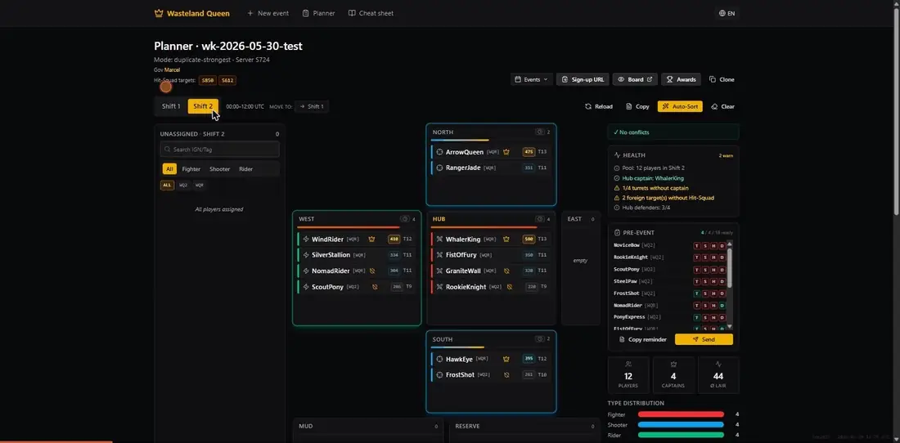

# Wasteland Queen

[](https://github.com/HoiPolloi-labs/WastelandQueen/actions/workflows/ci.yml)
[](LICENSE)

> Coordination tool for the **Wasteland King (WK)** event in
> [_Puzzles & Survival_](https://puzzlesandsurvival.com/). Replaces the
> Google-Form → Excel → VBA-macro workflow our state used to slog through
> every two weeks with a public sign-up form, an auto-sorting planner with
> drag-and-drop, and a shareable read-only board.

**Live:** <https://waqu.app> ·
**Try the planner (editable sandbox):** <https://waqu.app/demo/wk-2026-06-06-demo/7101240d-07c3-48f0-ad53-f912bf95d303>
— drag, Auto-Sort, switch shifts; nothing saves, reload resets.


### The planner in action

Shift switching, the auto-sorted plaza (Hub + 4 turrets), the Mud / Reserve /
per-state Hit-Squad buckets, and the capacity-fill control — all live:



---

## What it does

Three URLs per WK event, each gated by its own random uuid token — no
accounts, no passwords, no registration.

| URL | Audience | What's there |
|---|---|---|
| **`/signup/:eventId/:signupToken`** | Every player | Mobile-first form (12 languages). IGN, alliance tag, server, tier, troop type, max-solo-lair, rally size, willing-captain, shift, pre-event checklist. Optional Vision-LLM auto-fill from a profile screenshot. |
| **`/plan/:eventId/:plannerToken`** | The organiser | Plaza visualisation with drag-and-drop. Auto-sort algorithm, conflict banner, health check, stats sidebar, per-state Hit-Squad buckets, NAP terms, Discord webhook, roster CSV/XLSX, token rotation, optional heroes-frag tracking. |
| **`/board/:eventId/:boardToken`** | The alliance | Read-only Plaza, PNG export, QR code linking back to the sign-up. |

Plus `/plan/new` to create a new event (anon-allowed; success screen returns all three URLs)
and `/awards/:eventId/:plannerToken` for post-event box distribution + governor cockpit.

The full game-mechanics reference lives in
[`docs/wasteland-king-guide.md`](docs/wasteland-king-guide.md) — terminology
canon (Hub, turret, mud, NAP, Super Reinforcement, Fast Comeback).

---

## Tech stack

- **Vite 6** · **React 19** · **TypeScript** strict (`noUncheckedIndexedAccess`)
- **Tailwind v4** via `@tailwindcss/vite` with inline `@theme` tokens in `src/index.css`
- **React Router v7**
- **@dnd-kit** for the planner drag-and-drop (mouse + touch sensors)
- **Supabase** Postgres + auto-REST + Realtime + Edge Functions
  (project `ecxuvcuvuawxriucarmh` in `eu-central-1`)
- **Zod** for form validation
- **react-i18next** + `i18next-browser-languagedetector` — 12 locales
  (en, de, ru, zh, ko, ja, it, tr, fr, uk, el, es), ~439-key parity, locale
  bundles lazy-loaded so the main chunk doesn't ship 12× translations
- **xlsx (SheetJS)** for roster import/export (dynamic-imported chunk)
- **html-to-image** + **qrcode** for the Board PNG/QR export
- **Vitest** + **happy-dom** for pure-function tests (170/170 passing)

---

## Run it locally

```bash
pnpm install
cp .env.example .env.local
# fill in VITE_SUPABASE_URL + VITE_SUPABASE_PUBLISHABLE_KEY from your
# Supabase project — see .env.example for the dashboard link

pnpm dev          # http://localhost:5173 — Vite dev server
pnpm typecheck    # tsc -b --noEmit
pnpm lint         # eslint .
pnpm test         # vitest watch
pnpm test:run     # one-shot vitest
pnpm build        # tsc -b && vite build → dist/
pnpm preview      # http://localhost:4173 — serve the production bundle
```

---

## Deploy

- **Frontend → Vercel.** Push to `main` → static build → auto-deploy.
  Env vars `VITE_SUPABASE_URL` + `VITE_SUPABASE_PUBLISHABLE_KEY` are set in
  the Vercel project settings.
- **Database → Supabase.** Schema lives in `supabase/migrations/0001..0038_*.sql`.
  Apply via Supabase MCP `apply_migration` (mirror each into the
  `supabase/migrations/` folder for the repo record).
- **Edge Functions → Supabase.** Four functions in `supabase/functions/`:
  - `token-exchange` — mints per-event JWTs (ES256 / HS256)
  - `extract-profile` — Claude Sonnet Vision; rate-limited (5/h per signup_token);
    dispatches on `kind: 'profile' | 'heroes'`
  - `notify-discord` — webhook poster for signup events + planner-triggered reminders;
    requires event-bound JWT with role-appropriate scope (planner for reminders,
    signup-or-planner for signup events)
  - `r` — short-URL resolver: `/s/:eventId` → signup, `/b/:eventId` → board (no JWT,
    service-role lookup, renders branded HTML on 404)
  Deploy via Supabase MCP `deploy_edge_function`.

Function secrets required (Supabase Dashboard → Functions → Manage secrets):
- `JWT_PRIVATE_KEY` (token-exchange — JWK with `d`, PKCS#8 PEM, or HS256 shared secret)
- `ANTHROPIC_API_KEY` (extract-profile — Vision-LLM autofill)

---

## Architecture sketch

```
   Signup URL          Planner URL          Board URL          Awards URL
       │                    │                   │                  │
       ▼                    ▼                   ▼                  ▼
 ┌──────────────────────────────────────────────────────────────────────┐
 │  EventAuthGate — extracts :token, calls token-exchange Edge Function │
 │                  injects JWT into supabase-js (REST + Realtime)      │
 └──────────────────────────────────────────────────────────────────────┘
       │                    │                   │                  │
       ▼                    ▼                   ▼                  ▼
 ┌──────────────────────────────────────────────────────────────────────┐
 │  Supabase Postgres                                                   │
 │  ─ events / signups / assignments / nap_terms / event_secrets        │
 │  ─ RLS keyed off event_id_claim() + event_role_claim()               │
 │  ─ Realtime publishes events + signups + assignments + nap_terms     │
 │  ─ SECURITY DEFINER RPCs: create_event, update_signup_self,          │
 │    rotate_event_tokens, set_event_secret, …                          │
 └──────────────────────────────────────────────────────────────────────┘
```

For the deeper engineering context — RLS model, auto-sort algorithm, WK
domain gotchas, i18n rules, working agreements with Claude as a coding
agent — see [`CLAUDE.md`](CLAUDE.md).

---

## Contributing

PRs and forks welcome — see [`CONTRIBUTING.md`](CONTRIBUTING.md) for setup,
the local check (typecheck · lint · test · build), and the house rules
(12-locale i18n parity, migrations-only schema changes, the per-event-token
auth model). Security issues go through [`SECURITY.md`](SECURITY.md), not
public issues. Be kind — [`CODE_OF_CONDUCT.md`](CODE_OF_CONDUCT.md).

## License

[MIT](LICENSE) © HoiPolloi-labs. Fork it for your own state — bring your own
Supabase project (the publishable key is the only key the client ships; all
real secrets stay in Supabase function secrets).
